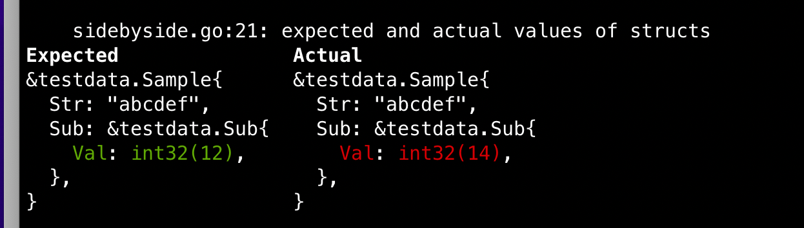

# Deepequal

Package with protobuf-friendly deepequal functionality.

As you probably know, `reflect.DeepEqual` should not work for structures generated with protoc-gen-go because of their
hidden service fields. This modified version of `reflect.DeepEqual` takes care of this and call `proto.Equal`
for values of these types.

Also, there's a `deepequal.SideBySide` function that can be used in tests to show a difference between expected
and actual values side by side.




## Installation

```shell
go get github.com/sirkon/deepequal
```